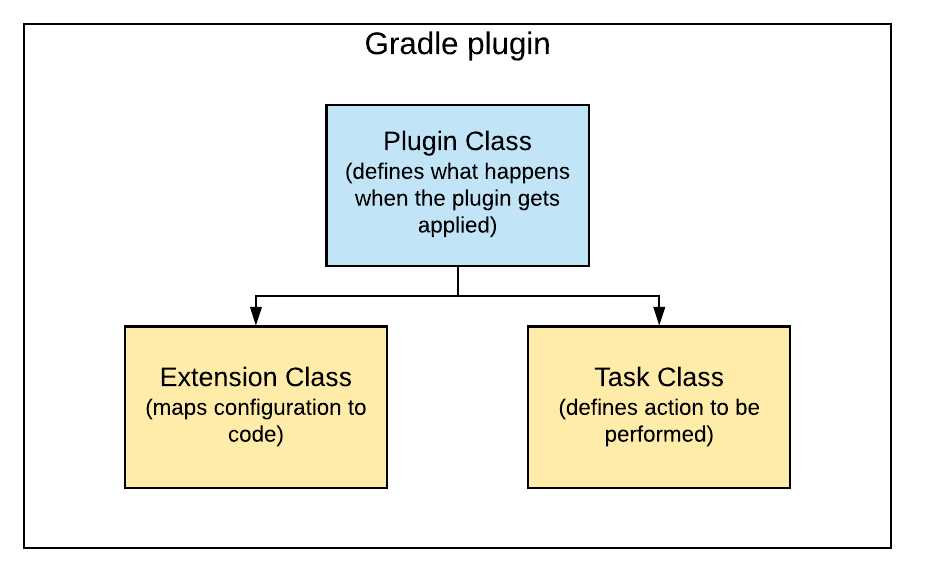
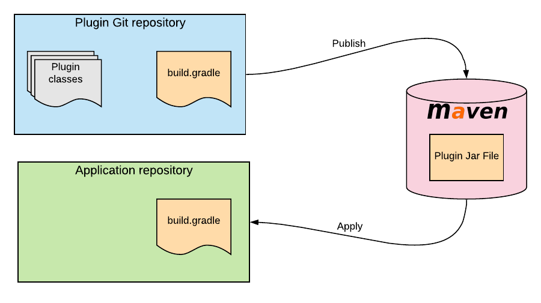

# jenkinsfile generator

Reducing Boilerplate Code with jenkinnsfile maven plugin
> More Time for Feature and functionality Through a simple set of jenkinsfile templates and saving 60% of development time

## Key Features

* Auto generate by gradle task
* Auto JUnit Tests detector by adding "JUnit Tests" stage
* Auto Integration Tests detector by adding "Integration Tests" stage
* Auto Dockerfile detector by adding "Build Docker" stage
* Auto Maven artifact detector by adding "Deploy Maven Artifact" stage
* Auto Sonar report detector by adding "Sonar Report" stage
* Auto Sonar Quality Gate validator by adding "Quality Gate" stage
* Auto Deployment to Cloud Platform by adding "Deployment" stage
* Auto Deployment to Cloud Platform by adding "Deployment" stage
* Auto Publish to Maven Artifactory "Publish" stage
* Auto Versioning from Maven Library "Versioning" stage
* Auto Tagging from Maven Library "Tag Release" stage

## How to use

```
buildscript {
    repositories {
        gradlePluginPortal()
    }
    dependencies {
        ...
        classpath 'de.microtema:jenkinsfile-gradle-plugin:1.0-SNAPSHOT'
    }
}

...
apply {
    ...
    plugin 'de.microtema.jenkinsfile'
}

jenkinsfile {
    appName = project.name
}
```

## Output

> Jenkinsfile
> NOTE: This is an example file.

```
pipeline {

    agent any
    
    environment {
        APP_NAME = 'mmc-cccpic-service'
    }

    stages {

        stage ('Unit Tests') {
            steps {
                sh './gradlew test'
            }
        }
    }
}
```

## Plugin Architecture

So what classes do we need in a plugin, and how do they relate to our specific requirements for this example?



* plugin class this defines what happens when the plugin gets applied. This may be to create some tasks that can be
  executed in the build, or configure the build in some way. In the case of the file-diff plugin, we’ll add a task to do
  the diff

* extension class this is a data object, representing the configuration that can be set for the plugin in build.gradle.
  For the file-diff plugin it will contain the two input files whose size will be compared.

* task class this class defines an action to be performed. An instance of it is normally created and bound to a task
  name made available to the user to run in a Gradle command. For our plugin, we’ll add a task to do the diff, and it
  will be available to the user by running ./gradlew jenkinsfile.

## Publishing Gradle plugins

When you write a plugin in Gradle, if you want to share it between multiple projects then the best option is to create
the plugin in a separate repository. This way, you can publish it to a private or public Maven repository, and then
apply it in whatever project you need:



Of course you can also publish to Maven local (on your personal development machine), which we’ll be using for this
example.

## Technology Stack

* Groovy 3.0.7
  * Streams
  * Lambdas
* Third Party Libraries
  * Commons-BeanUtils (Apache License)
  * Commons-IO (Apache License)
  * Commons-Lang3 (Apache License)
  * Spock (EPL 1.0 License)
* Code-Analyses
  * Sonar
  * Jacoco

## Test Coverage threshold

> 95%

## License

MIT (unless noted otherwise)
